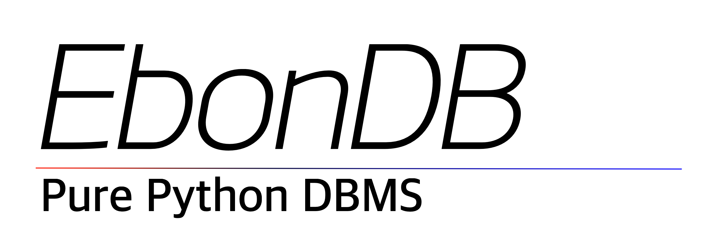

<h1>Pure Python DBMS.</h1>
<h4>
This is the main page of the EbonDB documentation page. click on the link below for documents.
</h4>

<h3>
<a href="ABOUT.md">About</a>
|
<a href="HOWTO.md">How to use</a>
</h3>